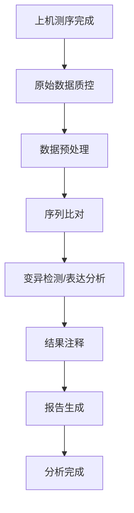

我们设计生信分析界面时，需要考虑生信分析的特点：通常以任务（或作业）为单位，每个任务可以包含多个样本，分析流程可能包括多个步骤（如质控、比对、变异检测等），并且分析过程通常是自动化的，但需要监控和结果查看。

生信分析界面可以包括以下部分：

分析任务列表：显示所有生信分析任务，包括任务状态、创建时间、完成进度等。

创建分析任务：可以选择样本或混样（从上机测序完成的任务中选择）并选择分析流程（如标准分析、自定义分析等）。

分析任务详情：包括任务概览、分析步骤的进度、结果文件列表、质量评估报告等。

结果查看和下载：提供分析结果的可视化展示和文件下载。

下面我们详细设计生信分析任务的界面。

1. 生信分析任务中心
类似于实验任务和测序任务，我们设计一个生信分析任务中心，包含三个标签页：待分析、分析中、已完成。

text
┌─────────────────────────────────────────────────────────┐
│ 生信分析任务中心                        [创建分析任务] [+] │
├─────────────────────────────────────────────────────────┤
│ 🔘 待分析任务(5)    🔘 分析中任务(3)    🔘 已完成任务   │
├─────────────────────────────────────────────────────────┤
│                                                         │
│ 待分析任务列表:                                        │
│ ┌──┬────────────┬──────────┬──────────┬──────────────┐ │
│ │□ │ SEQ_001    │ 2混样    │ 2024-05-20│ [开始分析]  │ │
│ │□ │ SEQ_002    │ 1混样    │ 2024-05-20│ [开始分析]  │ │
│ │□ │ SEQ_003    │ 3混样    │ 2024-05-20│ [开始分析]  │ │
│ └──┴────────────┴──────────┴──────────┴──────────────┘ │
│                                                         │
│ [全选] [批量创建分析任务]                              │
│                                                         │
└─────────────────────────────────────────────────────────┘
2. 创建分析任务界面
创建分析任务时，需要选择测序任务（已完成测序且未分析的任务）和分析流程。

text
┌─────────────────────────────────────────────────────────┐
│ 创建生信分析任务 - 步骤1/2                               │
├─────────────────────────────────────────────────────────┤
│ 选择测序任务:                                          │
│ ┌─────────────────────────────────────────────────────┐ │
│ │ 搜索测序任务: [_______________] [搜索]              │ │
│ │                                                     │ │
│ │ ┌──┬────────────┬──────────┬──────────┬──────────┐  │ │
│ │ │□ │ SEQ_20240520_001 │ 混样数:2 │ 数据量:200GB │  │ │
│ │ │□ │ SEQ_20240520_002 │ 混样数:1 │ 数据量:100GB │  │ │
│ │ │□ │ SEQ_20240520_003 │ 混样数:3 │ 数据量:300GB │  │ │
│ │ └──┴────────────┴──────────┴──────────┴──────────┘  │ │
│ └─────────────────────────────────────────────────────┘ │
│                                                         │
│ [下一步:选择分析流程]                                  │
│                                                         │
└─────────────────────────────────────────────────────────┘
第二步，选择分析流程和参数：

text
┌─────────────────────────────────────────────────────────┐
│ 创建生信分析任务 - 步骤2/2                               │
├─────────────────────────────────────────────────────────┤
│ 分析流程配置:                                          │
│ ┌─────────────────────────────────────────────────────┐ │
│ │ 分析流程: ▾ 标准胚系变异分析                        │ │
│ │ 版本: v2.1.0                                        │ │
│ │                                                     │ │
│ │ 参考基因组: ▾ GRCh38                                │ │
│ │ 注释数据库: ▾ dbSNP154, gnomAD, ClinVar            │ │
│ │                                                     │ │
│ │ 分析步骤:                                           │ │
│ │  ▢ 原始数据质控 (FastQC)                           │ │
│ │  ▢ 接头去除 (Trimmomatic)                          │ │
│ │  ▢ 序列比对 (BWA-MEM)                              │ │
│ │  ▢ 标记重复序列 (GATK MarkDuplicates)              │ │
│ │  ▢ 碱基质量重校准 (GATK BaseRecalibrator)          │ │
│ │  ▢ 变异检测 (GATK HaplotypeCaller)                 │ │
│ │  ▢ 变异注释 (ANNOVAR)                              │ │
│ │  ▢ 生成报告 (MultiQC)                              │ │
│ └─────────────────────────────────────────────────────┘ │
│                                                         │
│ 任务设置:                                              │
│ ┌─────────────────────────────────────────────────────┐ │
│ │ 任务名称: ANALYSIS_20240520_001                     │ │
│ │ 负责人: 陈七                                        │ │
│ │ 优先级: ▾ 普通                                      │ │
│ │ 备注: [_________________________________]           │ │
│ └─────────────────────────────────────────────────────┘ │
│                                                         │
│ [上一步] [创建分析任务]                                │
│                                                         │
└─────────────────────────────────────────────────────────┘
3. 分析任务详情页
分析任务详情页显示任务进度和结果概览。

text
┌─────────────────────────────────────────────────────────┐
│ 生信分析任务: ANALYSIS_20240520_001      [返回列表] [设置]│
├─────────────────────────────────────────────────────────┤
│ 任务信息:                                              │
│ ┌─────────────────┬─────────────────┬─────────────────┐ │
│ │ 状态: 🔄 分析中  │ 负责人: 陈七    │ 创建: 05-20 18:00│ │
│ │ 进度: 65%       │ 预计完成: 06:00 │ 已运行: 2小时   │ │
│ └─────────────────┴─────────────────┴─────────────────┘ │
│                                                         │
│ 分析步骤进度:                                          │
│ ┌──────────────┬───────────┬───────────┬─────────────┐ │
│ │    步骤      │   状态    │   进度    │   耗时      │ │
│ ├──────────────┼───────────┼───────────┼─────────────┤ │
│ │ 数据质控     │ ✅ 完成   │  100%     │  15分钟     │ │
│ │ 接头去除     │ ✅ 完成   │  100%     │  20分钟     │ │
│ │ 序列比对     │ ✅ 完成   │  100%     │  45分钟     │ │
│ │ 标记重复     │ ✅ 完成   │  100%     │  10分钟     │ │
│ │ 质量重校准   │ 🔄 运行中 │  65%      │  已运行30分钟│ │
│ │ 变异检测     │ ⏳ 待开始 │  0%       │  -          │ │
│ │ 变异注释     │ ⏳ 待开始 │  0%       │  -          │ │
│ │ 生成报告     │ ⏳ 待开始 │  0%       │  -          │ │
│ └──────────────┴───────────┴───────────┴─────────────┘ │
│                                                         │
│ 实时日志:                                              │
│ ┌─────────────────────────────────────────────────────┐ │
│ │ 2024-05-20 20:15:00 - 开始碱基质量重校准步骤        │ │
│ │ 2024-05-20 20:20:00 - 处理样本S001                  │ │
│ │ 2024-05-20 20:25:00 - 处理样本S002                  │ │
│ │ 2024-05-20 20:30:00 - 处理样本S003                  │ │
│ │ ...                                                 │ │
│ └─────────────────────────────────────────────────────┘ │
│                                                         │
│ [暂停任务] [停止任务] [查看详细日志]                  │
│                                                         │
└─────────────────────────────────────────────────────────┘
4. 分析结果查看界面
分析完成后，可以查看和下载分析结果。

text
┌─────────────────────────────────────────────────────────┐
│ 分析结果 - ANALYSIS_20240520_001          [返回任务] [下载]│
├─────────────────────────────────────────────────────────┤
│ 结果概览:                                              │
│ ┌─────────────────┬─────────────────┬─────────────────┐ │
│ │ 总样本数: 3     │ 比对率: 98.5%   │ 平均覆盖度: 50x │ │
│ │ 变异总数: 4.2M  │ SNP: 3.8M       │ InDel: 0.4M     │ │
│ └─────────────────┴─────────────────┴─────────────────┘ │
│                                                         │
│ 质量评估报告:                                          │
│ ┌─────────────────────────────────────────────────────┐ │
│ │ 📊 FastQC报告: 所有样本质控通过                     │ │
│ │ 📊 比对统计: 各样本比对率均在98%以上                 │ │
│ │ 📊 覆盖度分析: 目标区域覆盖度均匀                    │ │
│ │ 📊 变异统计: 变异类型分布正常                       │ │
│ └─────────────────────────────────────────────────────┘ │
│                                                         │
│ 结果文件列表:                                          │
│ ┌──────────────────┬──────────────┬───────────────────┐ │
│ │     文件类型     │   文件大小   │     下载次数      │ │
│ ├──────────────────┼──────────────┼───────────────────┤ │
│ │ 变异检测VCF文件  │    2.5GB     │        5         │ │
│ │ 变异注释报告     │    1.2GB     │        3         │ │
│ │ 分析汇总报告     │    15MB      │       10         │ │
│ │ 原始数据质控报告 │    5MB       │        2         │ │
│ │ 比对统计报告     │    8MB       │        2         │ │
│ └──────────────────┴──────────────┴───────────────────┘ │
│                                                         │
│ 可视化图表:                                            │
│ ┌─────────────────────────────────────────────────────┐ │
│ │  [覆盖度分布图] [变异频谱图] [插入片段分布图]       │ │
│ │                                                     │ │
│ │                [显示图表]                           │ │
│ └─────────────────────────────────────────────────────┘ │
│                                                         │
│ [生成自定义报告] [发送结果] [归档任务]                │
│                                                         │
└─────────────────────────────────────────────────────────┘
5. 生信分析快捷操作面板
在生信分析任务中心右侧，可以放置一个快捷操作面板，提供常用功能。

text
┌─────────────────────────────────────────────────────────┐
│ 生信分析快捷操作面板                                    │
├─────────────────────────────────────────────────────────┤
│ 🚀 批量操作                                            │
│    [批量创建任务] [批量下载]                           │
│                                                         │
│ 📊 分析监控                                            │
│    [运行中任务] [系统负载]                             │
│                                                         │
│ ⚙️ 流程管理                                            │
│    [流程模板] [参数设置]                               │
│                                                         │
│ 📁 结果管理                                            │
│    [结果浏览] [数据归档]                               │
│                                                         │
│ 🔍 快速搜索                                            │
│    [搜索分析任务] [搜索样本]                           │
│                                                         │
│ 📈 统计报表                                            │
│    [任务统计] [质量统计]                               │
│                                                         │
└─────────────────────────────────────────────────────────┘
6. 技术实现要点
状态管理
生信分析任务的状态管理较为复杂，因为分析流程通常包含多个步骤，且每个步骤可能运行时间较长。

javascript
// 生信分析任务状态
const analysisTaskState = {
  id: 'ANALYSIS_20240520_001',
  status: 'running', // pending, running, completed, failed
  progress: 65,
  currentStep: 'base_recalibration',
  steps: {
    qc: { status: 'completed', progress: 100, startTime: '...', endTime: '...' },
    trimming: { status: 'completed', progress: 100, startTime: '...', endTime: '...' },
    alignment: { status: 'completed', progress: 100, startTime: '...', endTime: '...' },
    mark_duplicates: { status: 'completed', progress: 100, startTime: '...', endTime: '...' },
    base_recalibration: { status: 'running', progress: 65, startTime: '...', endTime: null },
    variant_calling: { status: 'pending', progress: 0, startTime: null, endTime: null },
    annotation: { status: 'pending', progress: 0, startTime: null, endTime: null },
    reporting: { status: 'pending', progress: 0, startTime: null, endTime: null }
  },
  samples: ['S001', 'S002', 'S003'],
  sequencerTaskId: 'SEQ_20240520_001'
};
结果文件管理
生信分析会产生大量结果文件，需要良好的组织和管理。

java
// 结果文件组织结构
public class AnalysisResult {
    private String taskId;
    private List<ResultFile> resultFiles;
    
    public static class ResultFile {
        private String fileType; // VCF, BAM, REPORT, etc.
        private String filePath;
        private String fileSize;
        private String description;
        private int downloadCount;
    }
}
7. 用户交互流程
典型的使用流程：
创建分析任务：从已完成测序的任务中选择数据，配置分析流程。

监控分析进度：在任务详情页实时查看分析步骤的进度和日志。

查看分析结果：分析完成后，查看质量评估报告和结果文件。

下载和分享结果：下载结果文件或生成自定义报告。

异常处理：
分析任务失败时，显示错误日志并提供重试或调试选项。

提供任务暂停和停止功能，以便在需要时中断分析。

这样的设计确保了生信分析任务的完整生命周期管理，从任务创建到结果查看，提供了清晰的进度跟踪和丰富的結果展示。

设计一个完整的生信分析界面。

# 生信分析任务界面设计

## 生信分析流程概述



## 1. 生信分析任务中心

### 生信分析任务首页
```
┌─────────────────────────────────────────────────────────┐
│ 生信分析任务中心                        [创建分析任务] [+] │
├─────────────────────────────────────────────────────────┤
│ 🔘 待分析任务(8)    🔘 分析中任务(3)    🔘 已完成任务   │
├─────────────────────────────────────────────────────────┤
│                                                         │
│ 待分析任务列表:                                        │
│ ┌──┬────────────┬──────────┬──────────┬──────────────┐ │
│ │□ │ SEQ_001    │ 2混样    │ 200GB    │ [开始分析]   │ │
│ │□ │ SEQ_002    │ 1混样    │ 100GB    │ [开始分析]   │ │
│ │□ │ SEQ_003    │ 3混样    │ 300GB    │ [开始分析]   │ │
│ │□ │ SEQ_004    │ 4混样    │ 400GB    │ [开始分析]   │ │
│ └──┴────────────┴──────────┴──────────┴──────────────┘ │
│                                                         │
│ [全选] [批量创建分析任务]                              │
│                                                         │
└─────────────────────────────────────────────────────────┘
```

### 分析中任务列表
```
┌─────────────────────────────────────────────────────────┐
│ 分析中任务(3)                                           │
├─────────────────────────────────────────────────────────┤
│ ┌─────────────────────────────────────────────────────┐ │
│ │ ANALYSIS_20240520_001               进度: 65% ████   │ │
│ │ 样本: 8个样本                   当前步骤: 变异检测   │ │
│ │ 数据: 200GB                   预计完成: 2小时后     │ │
│ │ 分析流程: 标准WGS              负责人: 生信分析员A   │ │
│ │                                                    │ │
│ │ [查看详情] [暂停] [更多▾]                          │ │
│ └─────────────────────────────────────────────────────┘ │
│                                                         │
│ ┌─────────────────────────────────────────────────────┐ │
│ │ ANALYSIS_20240520_002               进度: 30% ██     │ │
│ │ 样本: 12个样本                  当前步骤: 序列比对   │ │
│ │ 数据: 150GB                   预计完成: 5小时后     │ │
│ │ 分析流程: RNA-Seq              负责人: 生信分析员B   │ │
│ │                                                    │ │
│ │ [查看详情] [暂停] [更多▾]                          │ │
│ └─────────────────────────────────────────────────────┘ │
└─────────────────────────────────────────────────────────┘
```

## 2. 创建分析任务界面

### 分析任务配置向导
```
┌─────────────────────────────────────────────────────────┐
│ 创建生信分析任务 - 步骤1/3                               │
├─────────────────────────────────────────────────────────┤
│ 选择测序数据:                                          │
│ ┌─────────────────────────────────────────────────────┐ │
│ │ 搜索测序任务: [_______________] [搜索]              │ │
│ │                                                     │ │
│ │ ┌──┬────────────┬──────────┬──────────┬──────────┐  │ │
│ │ │□ │ SEQ_20240520_001 │ 混样数:2 │ 数据量:200GB │  │ │
│ │ │□ │ SEQ_20240520_002 │ 混样数:1 │ 数据量:100GB │  │ │
│ │ │□ │ SEQ_20240520_003 │ 混样数:3 │ 数据量:300GB │  │ │
│ │ └──┴────────────┴──────────┴──────────┴──────────┘  │ │
│ └─────────────────────────────────────────────────────┘ │
│                                                         │
│ [下一步:选择分析流程]                                  │
│                                                         │
└─────────────────────────────────────────────────────────┘
```

### 分析流程选择界面
```
┌─────────────────────────────────────────────────────────┐
│ 创建生信分析任务 - 步骤2/3                               │
├─────────────────────────────────────────────────────────┤
│ 分析流程配置:                                          │
│ ┌─────────────────────────────────────────────────────┐ │
│ │ 分析类型: ▾ 全基因组测序 (WGS)                      │ │
│ │                                                     │ │
│ │ 可用流程模板:                                       │ │
│ │ ○ 标准胚系变异分析 (Germline Variant Calling)       │ │
│ │ ○ 体细胞变异分析 (Somatic Variant Calling)          │ │
│ │ ○ 结构变异分析 (Structural Variant Analysis)        │ │
│ │ ○ 拷贝数变异分析 (CNV Analysis)                     │ │
│ │ ○ 自定义分析流程                                    │ │
│ │                                                     │ │
│ │ 参考基因组: ▾ GRCh38 (hg38)                         │ │
│ │ 注释数据库: ▾ dbSNP154, gnomAD, ClinVar            │ │
│ │                                                     │ │
│ │ 分析步骤:                                           │ │
│ │ ▢ 原始数据质控 (FastQC)                             │ │
│ │ ▢ 接头去除 (Trimmomatic)                            │ │
│ │ ▢ 序列比对 (BWA-MEM)                                │ │
│ │ ▢ 标记重复序列 (GATK MarkDuplicates)                │ │
│ │ ▢ 碱基质量重校准 (GATK BaseRecalibrator)            │ │
│ │ ▢ 变异检测 (GATK HaplotypeCaller)                   │ │
│ │ ▢ 变异注释 (ANNOVAR)                                │ │
│ │ ▢ 生成报告 (MultiQC)                                │ │
│ └─────────────────────────────────────────────────────┘ │
│                                                         │
│ [上一步] [下一步:任务设置]                             │
│                                                         │
└─────────────────────────────────────────────────────────┘
```

### 任务参数设置界面
```
┌─────────────────────────────────────────────────────────┐
│ 创建生信分析任务 - 步骤3/3                               │
├─────────────────────────────────────────────────────────┤
│ 任务设置:                                              │
│ ┌─────────────────────────────────────────────────────┐ │
│ │ 任务名称: ANALYSIS_20240520_001                     │ │
│ │ 负责人: ▾ 生信分析员A                               │ │
│ │ 优先级: ▾ 普通                                      │ │
│ │ 计算资源: ▾ 标准节点 (32核, 128GB内存)              │ │
│ │ 存储位置: ▾ /data/analysis/                          │ │
│ │ 保留中间文件: ▾ 是 (用于调试)                       │ │
│ │ 备注: [_________________________________]           │ │
│ └─────────────────────────────────────────────────────┘ │
│                                                         │
│ 预计资源消耗:                                          │
│ ┌─────────────────┬─────────────────┬─────────────────┐ │
│ │ 预计计算时间:   │ 预计存储空间:   │ 预计成本:       │ │
│ │     8小时       │     500GB       │     120元       │ │
│ └─────────────────┴─────────────────┴─────────────────┘ │
│                                                         │
│ [上一步] [创建分析任务]                                │
│                                                         │
└─────────────────────────────────────────────────────────┘
```

## 3. 分析任务详情页

### 任务概览与进度监控
```
┌─────────────────────────────────────────────────────────┐
│ 生信分析任务: ANALYSIS_20240520_001      [返回列表] [设置]│
├─────────────────────────────────────────────────────────┤
│ 任务信息:                                              │
│ ┌─────────────────┬─────────────────┬─────────────────┐ │
│ │ 状态: 🔄 分析中  │ 负责人: 生信分析员A │ 创建: 05-20 18:00│ │
│ │ 进度: 65%       │ 预计完成: 06:00 │ 已运行: 2小时   │ │
│ └─────────────────┴─────────────────┴─────────────────┘ │
│                                                         │
│ 分析步骤进度:                                          │
│ ┌──────────────┬───────────┬───────────┬─────────────┐ │
│ │    步骤      │   状态    │   进度    │   耗时      │ │
│ ├──────────────┼───────────┼───────────┼─────────────┤ │
│ │ 数据质控     │ ✅ 完成   │  100%     │  15分钟     │ │
│ │ 接头去除     │ ✅ 完成   │  100%     │  20分钟     │ │
│ │ 序列比对     │ ✅ 完成   │  100%     │  45分钟     │ │
│ │ 标记重复     │ ✅ 完成   │  100%     │  10分钟     │ │
│ │ 质量重校准   │ 🔄 运行中 │  65%      │  已运行30分钟│ │
│ │ 变异检测     │ ⏳ 待开始 │  0%       │  -          │ │
│ │ 变异注释     │ ⏳ 待开始 │  0%       │  -          │ │
│ │ 生成报告     │ ⏳ 待开始 │  0%       │  -          │ │
│ └──────────────┴───────────┴───────────┴─────────────┘ │
│                                                         │
│ 资源监控:                                              │
│ ┌─────────────────┬─────────────────┬─────────────────┐ │
│ │    CPU使用      │    内存使用     │    磁盘IO       │ │
│ │     85% █████   │   72% ████      │   45% ███       │ │
│ └─────────────────┴─────────────────┴─────────────────┘ │
│                                                         │
└─────────────────────────────────────────────────────────┘
```

### 实时日志与监控界面
```
┌─────────────────────────────────────────────────────────┐
│ 分析任务监控 - ANALYSIS_20240520_001     [返回详情] [设置]│
├─────────────────────────────────────────────────────────┤
│ 实时日志:                                              │
│ ┌─────────────────────────────────────────────────────┐ │
│ │ 2024-05-20 20:15:00 INFO - 开始碱基质量重校准步骤    │ │
│ │ 2024-05-20 20:15:05 INFO - 加载参考基因组: GRCh38    │ │
│ │ 2024-05-20 20:20:00 INFO - 处理样本S001, 进度 15%    │ │
│ │ 2024-05-20 20:25:00 INFO - 处理样本S002, 进度 35%    │ │
│ │ 2024-05-20 20:30:00 INFO - 处理样本S003, 进度 55%    │ │
│ │ 2024-05-20 20:32:00 WARNING - 样本S004质量值略低     │ │
│ │ 2024-05-20 20:35:00 INFO - 处理样本S005, 进度 75%    │ │
│ │ ...                                                 │ │
│ └─────────────────────────────────────────────────────┘ │
│                                                         │
│ 系统资源图表:                                           │
│ ┌─────────────────┬─────────────────┬─────────────────┐ │
│ │   CPU使用率     │   内存使用率    │   磁盘IO        │ │
│ │    ████████     │   ████████      │   █████         │ │
│ │    ████████     │   ████████      │   █████         │ │
│ │    ████████     │   ██████        │   ████          │ │
│ │ 0┈┈┈┈┈┈┈┈┈┈┈┈100│ 0┈┈┈┈┈┈┈┈┈┈┈┈100│ 0┈┈┈┈┈┈┈┈┈┈┈┈100│ │
│ └─────────────────┴─────────────────┴─────────────────┘ │
│                                                         │
│ [暂停任务] [停止任务] [查看详细日志] [下载当前结果]    │
│                                                         │
└─────────────────────────────────────────────────────────┘
```

## 4. 分析结果查看界面

### 结果概览与质量评估
```
┌─────────────────────────────────────────────────────────┐
│ 分析结果 - ANALYSIS_20240520_001          [返回任务] [下载]│
├─────────────────────────────────────────────────────────┤
│ 分析概览:                                              │
│ ┌─────────────────┬─────────────────┬─────────────────┐ │
│ │ 总样本数: 8     │ 平均比对率: 98.5%│ 平均覆盖度: 50x │ │
│ │ 总变异数: 4.2M  │ SNP: 3.8M       │ InDel: 0.4M     │ │
│ │ 分析完成时间:   │ 2024-05-21 06:15│ 运行时间: 12h   │ │
│ └─────────────────┴─────────────────┴─────────────────┘ │
│                                                         │
│ 质量评估:                                              │
│ ┌─────────────────────────────────────────────────────┐ │
│ │ 📊 FastQC报告: 所有样本质控通过                     │ │
│ │ 📊 比对统计: 各样本比对率均在98%以上                 │ │
│ │ 📊 覆盖度分析: 目标区域覆盖度均匀                    │ │
│ │ 📊 变异统计: 变异类型分布正常                       │ │
│ │ 📊 数据质量: Q30 > 90%, 符合分析要求                │ │
│ └─────────────────────────────────────────────────────┘ │
│                                                         │
│ 结果文件:                                              │
│ ┌──────────────────┬──────────────┬───────────────────┐ │
│ │     文件类型     │   文件大小   │     下载次数      │ │
│ ├──────────────────┼──────────────┼───────────────────┤ │
│ │ 变异检测VCF文件  │    2.5GB     │        5         │ │
│ │ BAM比对文件      │    150GB     │        2         │ │
│ │ 变异注释报告     │    1.2GB     │        3         │ │
│ │ 分析汇总报告     │    15MB      │       10         │ │
│ │ 质控报告         │    5MB       │        8         │ │
│ │ 原始日志         │    2MB       │        1         │ │
│ └──────────────────┴──────────────┴───────────────────┘ │
│                                                         │
│ [生成分析报告] [发送结果] [归档数据]                  │
│                                                         │
└─────────────────────────────────────────────────────────┘
```

### 可视化分析结果界面
```
┌─────────────────────────────────────────────────────────┐
│ 分析结果可视化 - ANALYSIS_20240520_001    [返回] [导出图表]│
├─────────────────────────────────────────────────────────┤
│ 图表类型选择:                                           │
│ 🔘 覆盖度分析    🔘 变异频谱    🔘 质量分布    🔘 其他   │
│                                                         │
│ 覆盖度分布图:                                          │
│ ┌─────────────────────────────────────────────────────┐ │
│ │                 覆盖度深度分布                      │ │
│ │                                                    │ │
│ │        ██████████████████████                      │ │
│ │      ██████████████████████████                    │ │
│ │    ██████████████████████████████                  │ │
│ │  ██████████████████████████████████                │ │
│ │ 0┈┈┈┈┈┈┈10┈┈┈┈┈┈20┈┈┈┈┈┈30┈┈┈┈┈┈40┈┈┈┈┈┈50x         │ │
│ │                                                    │ │
│ │ 样本: ▾ S001 ▾ S002 ▾ S003 ▾ 所有样本             │ │
│ └─────────────────────────────────────────────────────┘ │
│                                                         │
│ 变异类型分布:                                          │
│ ┌─────────────────┬─────────────────┬─────────────────┐ │
│ │     SNP分布     │   InDel分布     │   功能影响      │ │
│ │                 │                 │                 │ │
│ │   同义: 45%     │  插入: 60%      │ 错义: 35%       │ │
│ │   错义: 35%     │  缺失: 40%      │ 同义: 45%       │ │
│ │   无义: 5%      │                 │ 无义: 5%        │ │
│ │   其他: 15%     │                 │ 其他: 15%       │ │
│ └─────────────────┴─────────────────┴─────────────────┘ │
│                                                         │
│ [保存图表] [导出PDF] [分享链接]                       │
│                                                         │
└─────────────────────────────────────────────────────────┘
```

## 5. 生信分析快捷操作面板

### 固定在右侧的快捷面板
```
┌─────────────────────────────────────────────────────────┐
│ 生信分析快捷操作面板                                    │
├─────────────────────────────────────────────────────────┤
│ 🚀 批量操作                                            │
│    [批量创建任务] [批量下载结果]                       │
│                                                         │
│ 📊 分析监控                                            │
│    [运行中任务] [系统负载] [队列状态]                  │ │
│                                                         │
| ⚙️ 流程管理                                            │
│    [流程模板] [参数设置] [版本管理]                    │
│                                                         │
│ 📁 数据管理                                            │
│    [结果浏览] [数据归档] [清理缓存]                    │
│                                                         │
│ 🔍 快速搜索                                            │
│    [搜索分析任务] [搜索变异] [搜索样本]                │
│                                                         │
│ 📈 统计报表                                            │
│    [任务统计] [资源使用] [质量统计]                    │
│                                                         │
│ 🛠️ 工具集                                             │
│    [VCF查看器] [BAM查看器] [序列查看器]                │
│                                                         │
└─────────────────────────────────────────────────────────┘
```

## 6. 技术实现要点

### 任务状态管理
```javascript
// 生信分析任务状态管理
class BioinformaticsTaskManager {
  constructor() {
    this.tasks = new Map();
  }

  // 更新任务状态
  updateTaskStatus(taskId, step, status, progress) {
    const task = this.tasks.get(taskId);
    if (task) {
      task.steps[step] = {
        status: status,
        progress: progress,
        updateTime: new Date()
      };
      
      // 计算总体进度
      task.overallProgress = this.calculateOverallProgress(task.steps);
      task.status = this.determineOverallStatus(task.steps);
    }
  }

  // 计算总体进度
  calculateOverallProgress(steps) {
    const totalSteps = Object.keys(steps).length;
    const completedSteps = Object.values(steps).filter(
      step => step.status === 'completed'
    ).length;
    const inProgress = Object.values(steps).find(
      step => step.status === 'running'
    );
    
    let progress = (completedSteps / totalSteps) * 100;
    
    // 如果有进行中的步骤，加上其进度
    if (inProgress) {
      progress += inProgress.progress / totalSteps;
    }
    
    return Math.min(100, progress);
  }
}
```

### 结果文件解析
```python
# 生信分析结果解析器
class AnalysisResultParser:
    def __init__(self, task_id):
        self.task_id = task_id
        self.results = {}
    
    def parse_vcf_stats(self, vcf_file):
        """解析VCF文件统计信息"""
        import pysam
        vcf = pysam.VariantFile(vcf_file)
        
        stats = {
            'total_variants': 0,
            'snps': 0,
            'indels': 0,
            'samples': list(vcf.header.samples)
        }
        
        for record in vcf:
            stats['total_variants'] += 1
            if len(record.ref) == 1 and len(record.alts[0]) == 1:
                stats['snps'] += 1
            else:
                stats['indels'] += 1
        
        return stats
    
    def parse_coverage_stats(self, bam_file):
        """解析BAM文件覆盖度统计"""
        import pysam
        bam = pysam.AlignmentFile(bam_file)
        
        coverage_data = {
            'mean_coverage': 0,
            'coverage_distribution': [],
            'mapping_rate': 0
        }
        
        # 计算覆盖度统计
        # ... 具体实现
        
        return coverage_data
```

### 数据库设计扩展
```sql
-- 生信分析任务表
CREATE TABLE bioinformatics_tasks (
    id BIGINT PRIMARY KEY AUTO_INCREMENT,
    task_name VARCHAR(100) NOT NULL,
    sequencer_task_id BIGINT,
    analysis_type ENUM('WGS', 'WES', 'RNA-Seq', 'ChIP-Seq', 'Custom'),
    workflow_template VARCHAR(100),
    reference_genome VARCHAR(50),
    status ENUM('pending', 'running', 'completed', 'failed', 'paused'),
    overall_progress DECIMAL(5,2) DEFAULT 0,
    assigned_to BIGINT,
    compute_resources JSON,
    expected_duration INT COMMENT '预计时长(分钟)',
    actual_duration INT COMMENT '实际时长(分钟)',
    created_time DATETIME DEFAULT CURRENT_TIMESTAMP,
    started_time DATETIME,
    completed_time DATETIME
);

-- 分析步骤表
CREATE TABLE analysis_steps (
    id BIGINT PRIMARY KEY AUTO_INCREMENT,
    task_id BIGINT NOT NULL,
    step_name VARCHAR(100) NOT NULL,
    step_order INT NOT NULL,
    status ENUM('pending', 'running', 'completed', 'failed') DEFAULT 'pending',
    progress DECIMAL(5,2) DEFAULT 0,
    start_time DATETIME,
    end_time DATETIME,
    log_file_path VARCHAR(500),
    output_files JSON
);

-- 分析结果表
CREATE TABLE analysis_results (
    id BIGINT PRIMARY KEY AUTO_INCREMENT,
    task_id BIGINT NOT NULL,
    result_type ENUM('vcf', 'bam', 'report', 'qc', 'log'),
    file_path VARCHAR(500) NOT NULL,
    file_size BIGINT,
    description TEXT,
    download_count INT DEFAULT 0,
    created_time DATETIME DEFAULT CURRENT_TIMESTAMP
);
```

## 7. 用户交互流程

### 完整的生信分析流程：
```
测序完成 → 创建分析任务 → 配置分析流程 → 提交计算 → 
监控进度 → 查看结果 → 下载报告 → 归档数据
```

### 关键功能特性：
1. **模板化分析**：预置常用分析流程，减少配置时间
2. **实时监控**：实时查看分析进度和系统资源
3. **可视化结果**：丰富的图表展示分析结果
4. **批量操作**：支持批量创建任务和下载结果
5. **资源管理**：智能分配计算资源，避免冲突

这样的设计确保了生信分析任务的：
- ✅ **易用性**：向导式任务创建，模板化配置
- ✅ **可监控性**：实时进度跟踪，详细日志查看
- ✅ **结果可视化**：丰富的图表和报告展示
- ✅ **高效性**：批量操作，资源智能分配
- ✅ **可追溯性**：完整的分析记录和结果管理

生信分析员可以轻松管理从数据到结果的整个分析流程，同时实验人员也能直观地查看分析进度和最终报告。