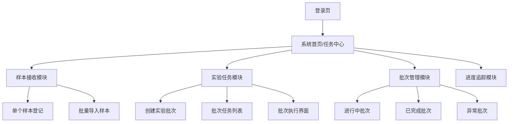

# 实验室系统界面设计：简洁易用的样本接收与实验任务

基于实验室真实操作习惯，我会设计一个**任务中心+批次管理**的双核心理念的界面。

## 系统整体布局设计



## 1. 样本接收界面设计

### 首页 - 任务中心视图
```
┌─────────────────────────────────────────────────────┐
│ 实验室管理系统 - 任务中心                            │
├─────────────────────────────────────────────────────┤
│ 📊 今日统计: 接收15样本 | 待实验8批次 | 进行中3批次 │
│ ⚡ 快捷操作: [样本接收] [创建批次] [查看进度]        │
└─────────────────────────────────────────────────────┘
```

### 样本接收主界面 - 两种模式并行
```
┌─────────────────────────────────────────────────────┐
│ 样本接收                                            │
├─────────────────────────────────────────────────────┤
│ 🔘 单个登记    🔘 批量导入    [扫描枪模式]          │
├─────────────────────────────────────────────────────┤
│                                                     │
│ 样本信息登记表:                                     │
│ ┌───────────────┐ ┌───────────────┐                 │
│ │ 样本编号:     │ │ 样本类型: ▾   │                 │
│ └───────────────┘ └───────────────┘                 │
│ ┌───────────────┐ ┌───────────────┐                 │
│ │ 样本名称:     │ │ 来源项目: ▾   │                 │
│ └───────────────┘ └───────────────┘                 │
│ ┌─────────────────────────────────┐                 │
│ │ 备注信息:                       │                 │
│ └─────────────────────────────────┘                 │
│                                                     │
│ [保存并继续]  [保存并查看列表]                      │
│                                                     │
└─────────────────────────────────────────────────────┘
```

### 批量导入界面
```
┌─────────────────────────────────────────────────────┐
│ 批量样本导入                                        │
├─────────────────────────────────────────────────────┤
│ 步骤1: 下载模板 → 步骤2: 填写数据 → 步骤3: 上传验证 │
├─────────────────────────────────────────────────────┤
│                                                     │
│ [下载Excel模板]          [拖拽文件到这里或点击上传] │
│                                                     │
│ 预览 (前5行):                                       │
│ ┌──────┬──────┬──────┬──────┬──────┐                │
│ │ 编号 │ 名称 │ 类型 │ 项目 │ 状态 │                │
│ ├──────┼──────┼──────┼──────┼──────┤                │
│ │ S001 │ 样本1│ DNA │ 项目A│ ✅    │                │
│ │ S002 │ 样本2│ RNA │ 项目B│ ⚠️   │                │
│ └──────┴──────┴──────┴──────┴──────┘                │
│                                                     │
│ [验证数据]                 [确认导入]               │
│                                                     │
└─────────────────────────────────────────────────────┘
```

## 2. 实验任务界面设计

### 实验任务中心 - 状态驱动的视图
```
┌─────────────────────────────────────────────────────┐
│ 实验任务中心                    [创建新批次] [+]     │
├─────────────────────────────────────────────────────┤
│ 📋 待分配样本 (15)    🔄 进行中批次 (3)    ✅ 已完成 │
├─────────────────────────────────────────────────────┤
│                                                     │
│ 待分配样本列表:                                     │
│ ┌──┬──────┬──────────┬──────────┬─────────────────┐ │
│ │□ │ S001 │ 样本1    │ DNA      │ [加入批次]      │ │
│ │□ │ S002 │ 样本2    │ RNA      │ [加入批次]      │ │
│ │□ │ S003 │ 样本3    │ DNA      │ [加入批次]      │ │
│ └──┴──────┴──────────┴──────────┴─────────────────┘ │
│                                                     │
│ [全选] [创建新批次并加入选中样本]                   │
│                                                     │
└─────────────────────────────────────────────────────┘
```

### 创建实验批次界面 - 向导式设计
```
┌─────────────────────────────────────────────────────┐
│ 创建实验批次 - 步骤1/3                               │
├─────────────────────────────────────────────────────┤
│ 批次基本信息:                                       │
│ ┌─────────────────────────────────────────────────┐ │
│ │ 批次编号: EXP_20240520_001                      │ │
│ │ 实验类型: ▾ 常规DNA测序                         │ │
│ │ 操作人员: 张三                                  │ │
│ │ 计划日期: 2024-05-20                            │ │
│ └─────────────────────────────────────────────────┘ │
│                                                     │
│ 选中样本 (3个):                                    │
│ S001, S002, S003                                   │
│                                                     │
│ [上一步] [下一步:选择试剂]                         │
│                                                     │
└─────────────────────────────────────────────────────┘
```

### 批次执行界面 - 实验员操作视图
```
┌─────────────────────────────────────────────────────┐
│ 实验批次: EXP_20240520_001        状态: 🔄 进行中   │
├─────────────────────────────────────────────────────┤
│ 步骤导航: 1.准备试剂 → 2.样本加载 → 3.仪器运行 → 4.QC│
├─────────────────────────────────────────────────────┤
│                                                     │
│ 当前步骤: 样本加载                                 │
│                                                     │
│ 96孔板布局预览:                                    │
│   1  2  3  4  5  6  7  8  9  10 11 12              │
│ A ██ ██ ██ ██ ██ ██ ██ ██ ██ ██ ██ ██             │
│ B ██ ██ ██ ██ ██ ██ ██ ██ ██ ██ ██ ██             │
│ ...                                                │
│ H ██ ██ ██ ██ ██ ██ ██ ██ ██ ██ ██ ██             │
│                                                     │
│ 样本分配:                                          │
│ ┌──────┬──────┬──────┬──────┐                      │
│ │ 位置 │ 样本 │ 状态 │ 操作 │                      │
│ ├──────┼──────┼──────┼──────┤                      │
│ │ A01  │ S001 │ ✅    │ 编辑 │                      │
│ │ A02  │ S002 │ ⏳    │ 编辑 │                      │
│ │ A03  │ S003 │ ⏳    │ 编辑 │                      │
│ └──────┴──────┴──────┴──────┘                      │
│                                                     │
│ [标记本步骤完成] [暂停批次] [遇到问题]             │
│                                                     │
└─────────────────────────────────────────────────────┘
```

## 3. 关键设计原则与实现

### 设计原则：
1. **状态驱动**：用颜色和图标清晰显示每个样本/批次的状态
2. **渐进式披露**：复杂操作分步骤、分页面完成
3. **即时反馈**：每个操作都有明确的成功/失败提示
4. **减少认知负荷**：使用实验室熟悉的术语和布局

### 技术实现要点：

#### 状态管理组件
```jsx
// 状态标签组件
const StatusBadge = ({ status }) => {
  const statusConfig = {
    'pending': { label: '待处理', color: 'gray', icon: '⏳' },
    'in_progress': { label: '进行中', color: 'blue', icon: '🔄' },
    'completed': { label: '已完成', color: 'green', icon: '✅' },
    'failed': { label: '失败', color: 'red', icon: '❌' }
  };
  
  const config = statusConfig[status];
  return (
    <span className={`badge badge-${config.color}`}>
      {config.icon} {config.label}
    </span>
  );
};
```

#### 批次创建向导
```jsx
// 批次创建向导组件
const BatchCreationWizard = () => {
  const [currentStep, setCurrentStep] = useState(1);
  const [batchData, setBatchData] = useState({
    samples: [],
    reagents: [],
    instruments: null
  });

  const steps = [
    { id: 1, title: '选择样本', component: SampleSelection },
    { id: 2, title: '配置试剂', component: ReagentConfiguration },
    { id: 3, title: '确认信息', component: Confirmation }
  ];

  return (
    <div className="wizard">
      <div className="steps-indicator">
        {steps.map(step => (
          <div key={step.id} className={`step ${currentStep >= step.id ? 'active' : ''}`}>
            {step.title}
          </div>
        ))}
      </div>
      
      <div className="step-content">
        {React.createElement(steps[currentStep-1].component, {
          data: batchData,
          onChange: setBatchData
        })}
      </div>
      
      <div className="wizard-actions">
        {currentStep > 1 && <button onClick={() => setCurrentStep(currentStep-1)}>上一步</button>}
        {currentStep < steps.length && <button onClick={() => setCurrentStep(currentStep+1)}>下一步</button>}
        {currentStep === steps.length && <button onClick={createBatch}>创建批次</button>}
      </div>
    </div>
  );
};
```

## 4. 移动端适配考虑

### 平板端优化：
- 触摸友好的大按钮
- 横向滚动的样本列表
- 手势支持（左滑查看详情，右滑返回）
- 离线操作支持

### 响应式布局示例：
```css
/* 移动端适配 */
@media (max-width: 768px) {
  .batch-creation-wizard {
    flex-direction: column;
  }
  
  .sample-list {
    grid-template-columns: 1fr;
  }
  
  .action-buttons {
    position: fixed;
    bottom: 0;
    left: 0;
    right: 0;
    padding: 10px;
    background: white;
    box-shadow: 0 -2px 10px rgba(0,0,0,0.1);
  }
}
```

## 5. 用户引导与培训

### 首次使用引导：
```jsx
// 新手引导组件
const OnboardingTour = () => {
  const steps = [
    {
      target: '.sample-reception-btn',
      content: '点击这里开始接收新样本',
      placement: 'bottom'
    },
    {
      target: '.batch-creation-btn', 
      content: '收集足够样本后，在这里创建实验批次',
      placement: 'bottom'
    }
  ];

  return (
    <Tour steps={steps} isOpen={isFirstLogin} onRequestClose={closeTour} />
  );
};
```

这样的设计确保了：
- ✅ **符合实验习惯**：批次操作、状态跟踪、质量控制
- ✅ **简洁易懂**：向导式操作、状态可视化、渐进式披露
- ✅ **高效实用**：批量操作、快捷入口、减少点击
- ✅ **易于上手**：新手引导、清晰标签、即时反馈

实验人员能够直观地理解系统逻辑，快速完成日常操作，同时系统也具备了处理复杂批次实验的能力。