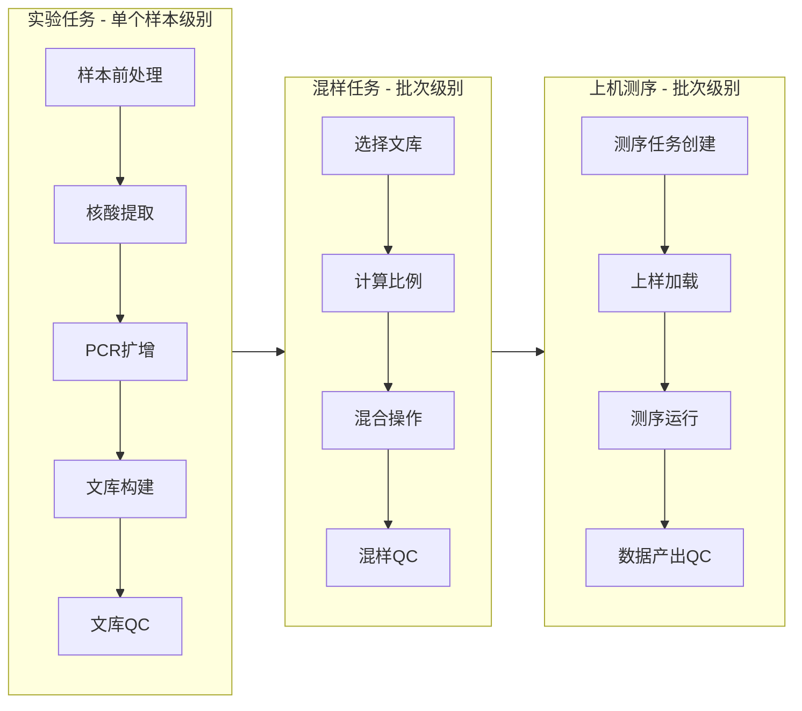

您提出了非常好的问题！**混样（Pooling）** 确实是NGS测序流程中一个关键且必须的步骤。让我重新梳理整个流程并设计相应的界面。

# 完整流程梳理与界面设计

## 流程定位：混样在整体流程中的位置



## 1. 混样任务的定位与界面设计

### 混样任务应该是**独立的流程环节**，原因：
- **操作对象不同**：实验任务处理单个样本，混样处理多个文库
- **时间点不同**：所有文库构建完成后才进行混样
- **负责人可能不同**：实验员 vs 测序专员

### 混样任务中心界面
```
┌─────────────────────────────────────────────────────────┐
│ 混样任务中心                            [创建混样任务] [+] │
├─────────────────────────────────────────────────────────┤
│ 🔘 待混样文库(8)    🔘 进行中混样(2)    🔘 已完成混样   │
├─────────────────────────────────────────────────────────┤
│                                                         │
│ 待混样文库列表:                                        │
│ ┌──┬──────────┬──────────┬──────────┬─────────────────┐ │
│ │□ │ LIB_001  │ S001     │ 10.5nM   │ [加入混样]      │ │
│ │□ │ LIB_002  │ S002     │ 12.3nM   │ [加入混样]      │ │
│ │□ │ LIB_003  │ S003     │ 9.8nM    │ [加入混样]      │ │
│ │□ │ LIB_004  │ S004     │ 11.2nM   │ [加入混样]      │ │
│ └──┴──────────┴──────────┴──────────┴─────────────────┘ │
│                                                         │
│ [全选] [创建混样任务并加入选中文库]                    │
│                                                         │
└─────────────────────────────────────────────────────────┘
```

### 混样任务详情页
```
┌─────────────────────────────────────────────────────────┐
│ 混样任务: POOL_20240520_001           [返回列表] [设置] │
├─────────────────────────────────────────────────────────┤
│ 混样信息:                                              │
│ ┌─────────────────┬─────────────────┬─────────────────┐ │
│ │ 状态: 🔄 进行中  │ 负责人: 王五    │ 创建: 05-20 16:30│ │
│ │ 文库数: 4个     │ 项目: 肿瘤测序  │ 预计完成: 今天  │ │
│ └─────────────────┴─────────────────┴─────────────────┘ │
│                                                         │
│ 步骤跟踪:                                              │
│ ○○○○○○○○○●○○○○○○○○○○ 50% 完成                         │
│                                                         │
│ 混样步骤:                                              │
│ ┌──────────────┬───────────┬───────────┬─────────────┐ │
│ │    步骤      │   状态    │   操作    │   时间      │ │
│ ├──────────────┼───────────┼───────────┼─────────────┤ │
│ │ 选择文库     │ ✅ 完成   │ [查看记录]│ 16:30-16:45 │ │
│ │ 计算比例     │ 🔄 进行中 │ [继续操作]│ 16:45-      │ │
│ │ 混合操作     │ ⏳ 待开始 │ [开始]    │ -           │ │
│ │ 混样QC       │ ⏳ 待开始 │ [开始]    │ -           │ │
│ └──────────────┴───────────┴───────────┴─────────────┘ │
│                                                         │
│ 选中文库: LIB_001(S001), LIB_002(S002), LIB_003(S003), │
│          LIB_004(S004)                                 │
│                                                         │
└─────────────────────────────────────────────────────────┘
```

### 混样比例计算界面
```
┌─────────────────────────────────────────────────────────┐
│ 混样比例计算                      [自动计算] [保存方案] │
├─────────────────────────────────────────────────────────┤
│ 混样方案: ▾ 等摩尔混合           目标总量: 100μl      │
│                                                         │
│ 文库混合比例:                                          │
│ ┌──────────┬──────────┬──────────┬─────────┬─────────┐ │
│ │ 文库编号 │ 浓度(nM) │ 混合比例 │ 体积(μl)│  备注   │ │
│ ├──────────┼──────────┼──────────┼─────────┼─────────┤ │
│ │ LIB_001  │  10.5    │   1:1    │  9.52   │         │ │
│ │ LIB_002  │  12.3    │   1:1    │  8.13   │         │ │
│ │ LIB_003  │   9.8    │   1:1    │ 10.20   │         │ │
│ │ LIB_004  │  11.2    │   1:1    │  8.93   │         │ │
│ ├──────────┼──────────┼──────────┼─────────┼─────────┤ │
│ │  总计    │          │          │  36.78  │         │ │
│ └──────────┴──────────┴──────────┴─────────┴─────────┘ │
│                                                         │
│ 高级设置:                                              │
│ ○ 等摩尔混合 (Equal Molarity)                         │
│ ○ 指定比例混合 (Custom Ratio)                         │
│ ○ 按数据量平衡 (Data Balancing)                       │
│                                                         │
│ 自定义比例:                                            │
│ LIB_001: ▾ 1x   LIB_002: ▾ 1x   LIB_003: ▾ 1x   ...   │
│                                                         │
│ [验证比例] [生成操作指引] [进入下一步:混合操作]        │
│                                                         │
└─────────────────────────────────────────────────────────┘
```

## 2. 上机测序任务中心界面设计

### 上机测序任务中心
```
┌─────────────────────────────────────────────────────────┐
│ 上机测序任务中心                        [创建测序任务] [+] │
├─────────────────────────────────────────────────────────┤
│ 🔘 待测序混样(5)    🔘 进行中测序(2)    🔘 已完成测序   │
├─────────────────────────────────────────────────────────┤
│                                                         │
│ 待测序混样列表:                                        │
│ ┌──┬────────────┬──────────┬──────────┬──────────────┐ │
│ │□ │ POOL_001   │ 文库数:4 │ 浓度:10nM│ [分配测序]   │ │
│ │□ │ POOL_002   │ 文库数:6 │ 浓度:12nM│ [分配测序]   │ │
│ │□ │ POOL_003   │ 文库数:3 │ 浓度:11nM│ [分配测序]   │ │
│ └──┴────────────┴──────────┴──────────┴──────────────┘ │
│                                                         │
│ [全选] [创建测序任务并加入选中混样]                    │
│                                                         │
└─────────────────────────────────────────────────────────┘
```

### 测序任务详情页
```
┌─────────────────────────────────────────────────────────┐
│ 测序任务: SEQ_20240520_001             [返回列表] [设置]│
├─────────────────────────────────────────────────────────┤
│ 测序信息:                                              │
│ ┌─────────────────┬─────────────────┬─────────────────┐ │
│ │ 状态: 🔄 进行中  │ 负责人: 赵六    │ 创建: 05-20 17:30│ │
│ │ 混样数: 2个     │ 项目: 肿瘤测序  │ 预计完成: 明天  │ │
│ └─────────────────┴─────────────────┴─────────────────┘ │
│                                                         │
│ 步骤跟踪:                                              │
│ ○○○○○○○○○●○○○○○○○○○○ 40% 完成                         │
│                                                         │
│ 测序步骤:                                              │
│ ┌──────────────┬───────────┬───────────┬─────────────┐ │
│ │    步骤      │   状态    │   操作    │   时间      │ │
│ ├──────────────┼───────────┼───────────┼─────────────┤ │
│ │ 任务配置     │ ✅ 完成   │ [查看记录]│ 17:30-17:45 │ │
│ │ 上样加载     │ 🔄 进行中 │ [继续操作]│ 17:45-      │ │
│ │ 测序运行     │ ⏳ 待开始 │ [开始]    │ -           │ │
│ │ 数据产出     │ ⏳ 待开始 │ [开始]    │ -           │ │
│ │ 数据QC       │ ⏳ 待开始 │ [开始]    │ -           │ │
│ └──────────────┴───────────┴───────────┴─────────────┘ │
│                                                         │
│ 选中混样: POOL_001(4文库), POOL_002(6文库)            │
│                                                         │
└─────────────────────────────────────────────────────────┘
```

### 测序任务配置界面
```
┌─────────────────────────────────────────────────────────┐
│ 测序任务配置                      [保存配置] [开始上样] │
├─────────────────────────────────────────────────────────┤
│ 测序仪器: ▾ NovaSeq 6000 (仪器编号: NSQ-001)          │
│ 测序模式: ▾ S4 Flow Cell (300 cycles)                 │
│                                                         │
│ 混样上样配置:                                          │
│ ┌────────────┬────────────┬─────────────┬─────────────┐ │
│ │  混样编号  │  上样位置  │ 上样体积(pM)│   备注      │ │
│ ├────────────┼────────────┼─────────────┼─────────────┤ │
│ │  POOL_001  │   Lane 1   │     100     │             │ │
│ │  POOL_002  │   Lane 2   │     100     │             │ │
│ │            │   Lane 3   │   空白对照  │             │ │
│ │            │   Lane 4   │   空白对照  │             │ │
│ │            │   Lane 5   │   空白对照  │             │ │
│ │            │   Lane 6   │   空白对照  │             │ │
│ │            │   Lane 7   │   空白对照  │             │ │
│ │            │   Lane 8   │   空白对照  │             │ │
│ └────────────┴────────────┴─────────────┴─────────────┘ │
│                                                         │
│ 测序参数:                                              │
│ ┌──────────────┬──────────────┬───────────────────────┐ │
│ │   读长设置   │   Index读长  │     化学版本          │ │
│ ├──────────────┼──────────────┼───────────────────────┤ │
│ │ Read1: 150bp │  i7: 8bp     │ ▾ v1.5试剂           │ │
│ │ Read2: 150bp │  i5: 8bp     │                       │ │
│ └──────────────┴──────────────┴───────────────────────┘ │
│                                                         │
│ 预计数据量: 200GB        预计运行时间: 24小时         │
│                                                         │
│ [从模板加载] [验证配置] [打印上样清单]                │
│                                                         │
└─────────────────────────────────────────────────────────┘
```

### 测序运行监控界面
```
┌─────────────────────────────────────────────────────────┐
│ 测序运行监控 - NovaSeq 6000 (NSQ-001)    [返回任务] [设置]│
├─────────────────────────────────────────────────────────┤
│ 运行概览:                                              │
│ ┌─────────────────┬─────────────────┬─────────────────┐ │
│ │ 运行ID: R2405201│ 开始: 18:00     │ 预计结束: 18:00+1│ │
│ │ 当前循环: 35    │ 总循环: 300     │ 剩余: 20.5小时  │ │
│ │ 运行状态: 正常  │ 错误数: 0       │ 数据量: 25GB    │ │
│ └─────────────────┴─────────────────┴─────────────────┘ │
│                                                         │
│ 实时监控图表:                                           │
│ ┌─────────────────────────────────┬───────────────────┐ │
│ │       簇密度趋势图              │   质量分数分布    │ │
│ │                                 │                   │ │
│ │    ██████████                   │    Q30: 92.5%     │ │
│ │   ████████████                  │    Q20: 95.8%     │ │
│ │  ██████████████                 │                   │ │
│ │ ████████████████                │                   │ │
│ └─────────────────────────────────┴───────────────────┘ │
│                                                         │
│ Lane状态:                                              │
│ ┌──────┬──────────┬────────────┬─────────────────────┐ │
│ │ Lane │  簇密度  │  质量Q30   │       状态          │ │
│ ├──────┼──────────┼────────────┼─────────────────────┤ │
│ │  1   │  250K/mm²│   92.8%    │       ✅ 正常       │ │
│ │  2   │  245K/mm²│   92.3%    │       ✅ 正常       │ │
│ │  3-8 │    -     │     -      │       ◯ 未使用      │ │
│ └──────┴──────────┴────────────┴─────────────────────┘ │
│                                                         │
│ 运行日志:                                              │
│ 18:00 开始运行...                                      │
│ 18:30 循环1完成，质量分数Q30: 90.5%                   │
│ 19:00 循环35完成，质量分数Q30: 92.5%                  │
│ ...                                                    │
│                                                         │
│ [暂停运行] [停止运行] [下载实时数据]                  │
│                                                         │
└─────────────────────────────────────────────────────────┘
```

## 3. 完整的流程衔接与状态同步

### 数据库状态流转
```sql
-- 实验任务完成时
UPDATE sample SET 
    experiment_status = 1,  -- 实验完成
    pipeline_stage = 'pool'  -- 进入混样阶段
WHERE experiment_id = ?;

-- 混样任务完成时  
UPDATE sample SET 
    pool_status = 1,        -- 混样完成
    pipeline_stage = 'run'   -- 进入测序阶段
WHERE id IN (混样中的样本ID);

-- 测序任务完成时
UPDATE sample SET 
    seq_status = 1,         -- 测序完成
    pipeline_stage = 'analysis' -- 进入分析阶段
WHERE id IN (测序任务中的样本ID);
```

### 任务状态联动
```javascript
// 任务状态管理器
class PipelineManager {
  // 实验任务完成时触发混样任务创建
  onExperimentComplete(experimentId) {
    const samples = this.getSamplesByExperiment(experimentId);
    const libraries = this.getLibrariesBySamples(samples);
    
    // 自动创建混样任务建议
    this.suggestPoolingTask(libraries);
  }
  
  // 混样任务完成时触发测序任务创建
  onPoolingComplete(poolId) {
    const pool = this.getPoolById(poolId);
    
    // 自动创建测序任务建议
    this.suggestSequencingTask([pool]);
  }
}
```

## 4. 用户操作流程总结

### 完整的工作流程：
1. **实验任务**：处理单个样本 → 产出文库
2. **混样任务**：组合多个文库 → 产出混样池
3. **测序任务**：上机测序 → 产出原始数据

### 界面导航路径：
```
实验任务中心 → 实验批次详情 → 完成实验
↓
混样任务中心 → 混样任务详情 → 完成混样  
↓
测序任务中心 → 测序任务详情 → 完成测序
↓
分析任务中心
```

这样的设计确保了：
- ✅ **流程清晰分离**：每个阶段职责明确
- ✅ **数据准确传递**：状态自动同步更新
- ✅ **操作符合习惯**：按照实验室真实工作流程
- ✅ **状态全程可追溯**：从样本到数据的完整链路

实验人员可以很清楚地在不同任务中心之间切换，每个环节都有专门的界面来支持相应的操作。